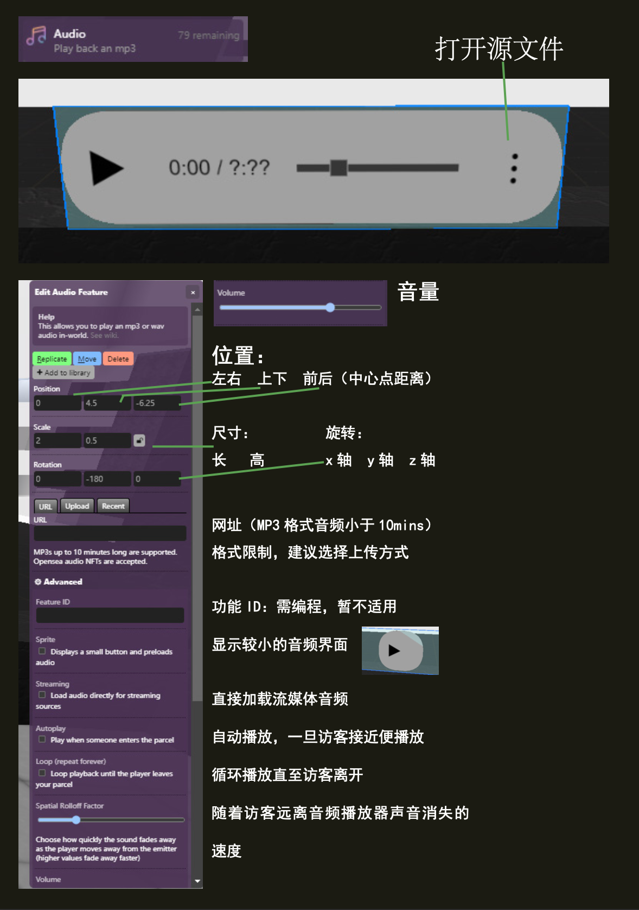
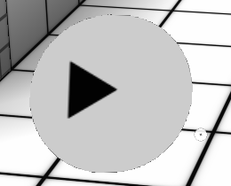

(audio)=
# 音频 Audio

音频功能是一个 MP3 的播放器。您可以给它添加上任何MP3链接。


## 编辑器




### URL 链接

支持长达 10 分钟的 MP3。 Opensea 音频 NFT 也可以。链接必须是 `https://` 开头，因为我们强制所有东西都是  `https://` 。同时也可以选择上传选项卡，上传音频。

```{note}
音频链接示例
`https://drive.google.com/u/0/uc?id=1vkRP84JlOo1fdn2_h-nc845kXD89J6g9&export=download`
```


### Sprite 小画面



显示一个较小的音频元素并预加载音频。

### Streaming 流式传输

直接流式传输音频，无需通过Voxels官方的服务器进行代理。应该可以加快音频播放速度，但如果您在托管服务器上有奇怪的规则，则可能不行。

### Autoplay  自动播放

一旦有人进入您的包裹，立即开始播放这段音频。（拥有权利的同时也被赋予了重大的责任）。

### Loop 循环

始终循环播放直至访客离开。

### Spatial rolloff factor 空间衰减因子

当玩家离开音频播放器时声音消失的速度。
值在 0 到 5 之间。

### Volume 音量

音频的声音的大小
值在0到1之间。

## 脚本属性
::::{tab-set}

:::{tab-item} url

`String.`; 链接必须是以 `https://` 开头，并且必须是以音频扩展后缀结尾，例如 `.mp3`

**get()**

```js
feature.get('url')
// returns: "https://..."
```

**set()**

```js
feature.set({'url':"https://www.myurl.com/file.mp3"})
```

**default**

`""`
:::

:::{tab-item} sprite
`Boolean.`

### get()

```js
feature.get('sprite')
// returns: false
```

### set()

```js
feature.set({'sprite': true})
```

### default

`false`

:::

:::{tab-item} streaming
`Boolean.`

### get()

```js
feature.get('streaming')
// returns: false
```

### set()

```js
feature.set({'streaming': true})
```
### default

`false`

:::

:::{tab-item} autoplay
`Boolean.`

### get()

```js
feature.get('autoplay')
// returns: false
```

### set()

```js
feature.set({'autoplay': true})
```
### default

`false`

:::

:::{tab-item} loop
`Boolean.`

### get()

```js
feature.get('loop')
// returns: false
```

### set()

```js
feature.set({'loop': true})
```

### default

`false`

:::

:::{tab-item} rolloffFactor
`double`; Value ranging from 0 to 5

### get()

```js
feature.get('rolloffFactor')
// returns: 1.6
```

### set()

```js
feature.set({'rolloffFactor': 1.6})
```

### default
`1.6`

:::

:::{tab-item} volume
`double`; Value ranging from 0 to 1

### get()

```js
feature.get('volume')
// returns: 0.5
```

### set()

```js
feature.set({'volume': 0.5})
```

### default
`0.5`

:::

:::{tab-item} type
`String`;

### get()

```js
feature.get('type')
/* or */
feature.type

// returns: 'audio'
```

:::
::::

## 脚本方法

::::{tab-set}

:::{tab-item} play()
```js
feature.play()
```
plays the audio
:::

:::{tab-item} pause()
```js
feature.pause()
```
pauses the audio
:::

:::{tab-item} stop()
```js
feature.stop()
```
stops the audio
:::

::::