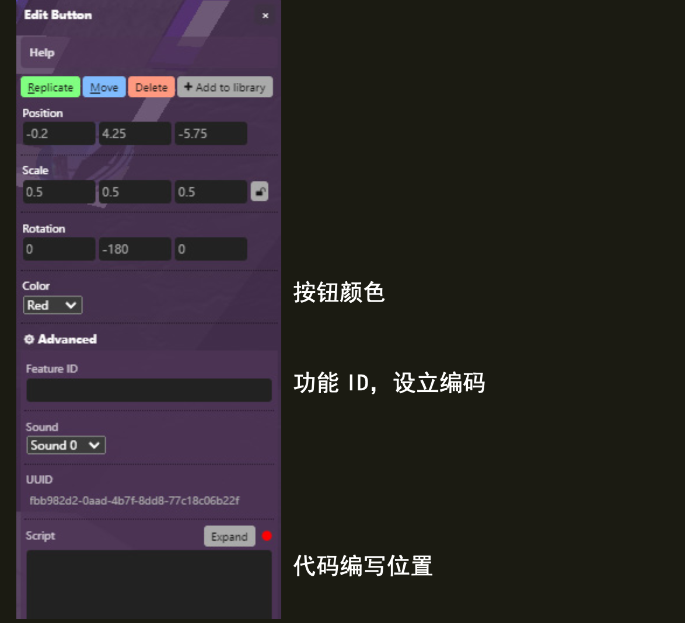

(button)=
# 按钮 Button

当你点击按钮时，按钮会被按下并发出声音。按钮可以用来触发脚本。


## Editor 编辑器



### Color 颜色

按钮可以是红色、绿色、蓝色或白色的。

### Sound 声音

有 14 种不同的按钮声音可供选择。

## 脚本属性

::::{tab-set}

:::{tab-item} color
`String.`; Options are 'white', 'red', 'green', and 'blue'.

**get()**

```js
feature.get('color')
// returns: "red"
```

**set()**

```js
feature.set({'color':"blue"})
```

**default**

`"red"`

:::

:::{tab-item} soundId
`Integer`; can be an integer in the range of 0 - 14.

```markdown
`'-1'` - None
`'0'` - ding dong
`'1'` - pong
`'2'` - pshlick - sounds like a hydraulic trigger
`'3'` - breet - sounds like a PC attempting to connect to internet
`'4'` - claclack - sounds like a someone spamming a keyboard
`'5'` - tpow Cling - sounds like a ball hitting a racket and then a metal pole
`'6'` - traarz - sounds like a printer
`'7'` - wuwuwuwu - sounds like a UFO
`'8'` - flickfli - sounds like someone going through a paper tray
`'9'` - pshing dong - sounds like a cymbal and a ding dong
`'10'` - bzing - sounds like a quick zing (honestly)
`'11'` - tadaw - sounds like a clown noise
`'12'` - shplow - sounds like a PVC pipe being hit
`'13'` - tshlshlsh - sounds like a notes counter
`'14'` - miaaaaaa - sounds like a cat being harassed
`'15'` - miaoowww - sounds like a hungry cat
```

**get()**

```js
feature.get('soundId')
// returns: "0"
```

**set()**

```js
feature.set({'soundId':"-1"})
//Remember the soundId has to be a String
```

**default**

`"0"`

:::

:::{tab-item} type
`String`; 

**get()**

```js
feature.get('type')
/* or */
feature.type
// returns: "button"
```
:::
::::

## 怎样使用
Using the scripting field, you can listen to clicks with

```js
feature.on('click',e=>{
Your action when click here
})
```

You can also know who clicked the button by doing:

```js
feature.on('click',e=>{
console.log(e.player)
})
```