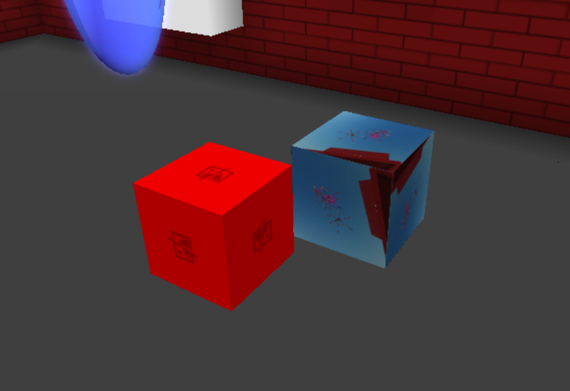
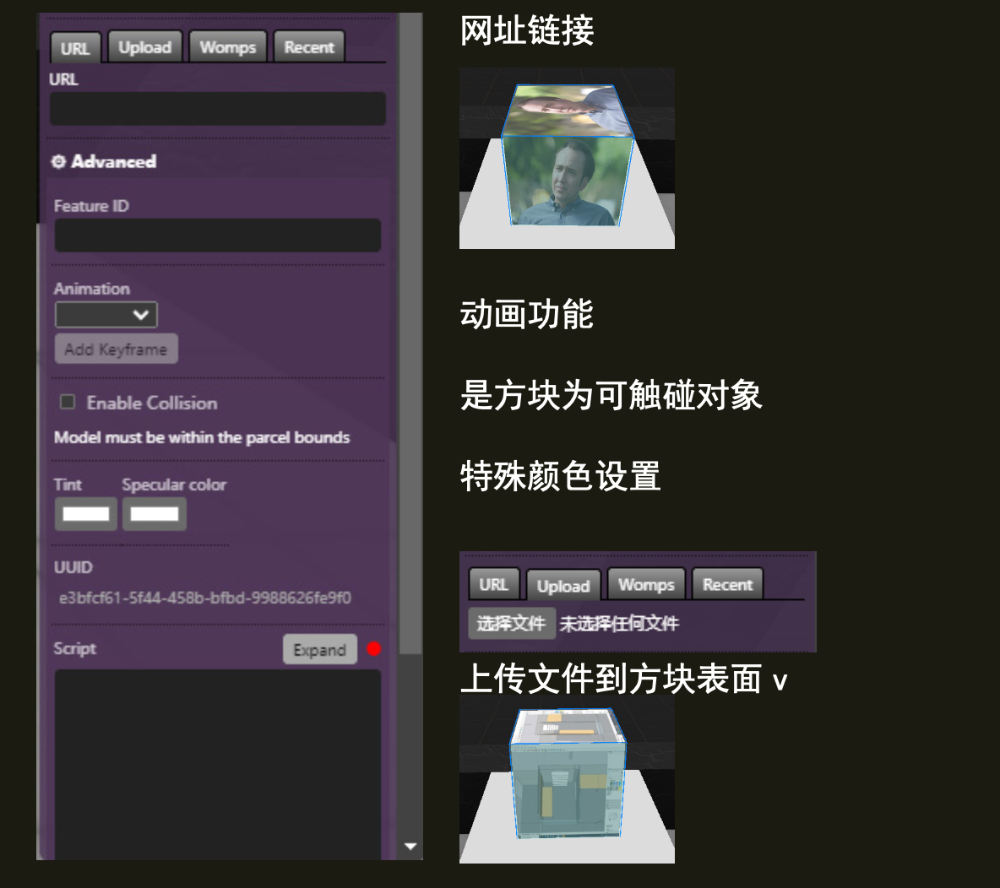

(cube)=
# 立方体 Cube

立方体功能是一个简单的立方体网格，您可以对其更换纹理或着色。



## Editor 编辑器



### URL

纹理图片的 URL。

```{note}
示例链接
https://www.voxels.com/images/newlogo.png
```

### Collidable 可触碰

`(可选)`;  让立方体成为可触碰对象

### Colors 颜色

`(可选)`;  允许您更改立方体的颜色。

## 脚本属性

::::{tab-set}
:::{tab-item} url
`String`; Links must be `https://` and must finish with an image extension.

**get()**

```js
feature.get('url')
// returns: "https://..."
```

**set()**

```js
feature.set({'url':"https://www.myurl.com/file.png"})
```

**default**

`""`
:::

:::{tab-item} Color
`String`; An Hex color string such as `#000`.

**get()**

```js
feature.get('color')
// returns: "#ffffff"...
```

**set()**

```js
feature.set({'color':"#4287f5"})
```

**default**

`"#000000"`
:::


:::{tab-item} collidable
collidable
`Boolean`

**get()**

```js
feature.get('collidable')
// returns: false
```

**set()**

```js
feature.set({'collidable': true})
```

**default**

`false`
:::

:::{tab-item} type
`String`;

**get()**

```js
feature.get('type')
/* or */
feature.type

// returns: 'cube'
```
:::
::::