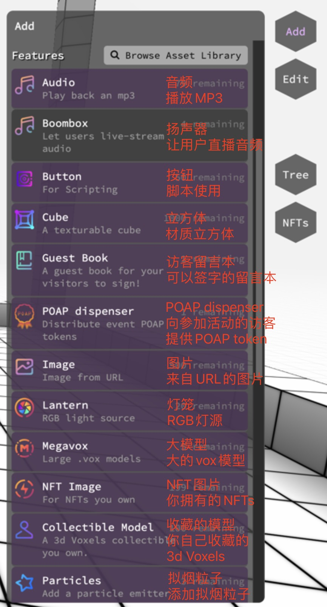
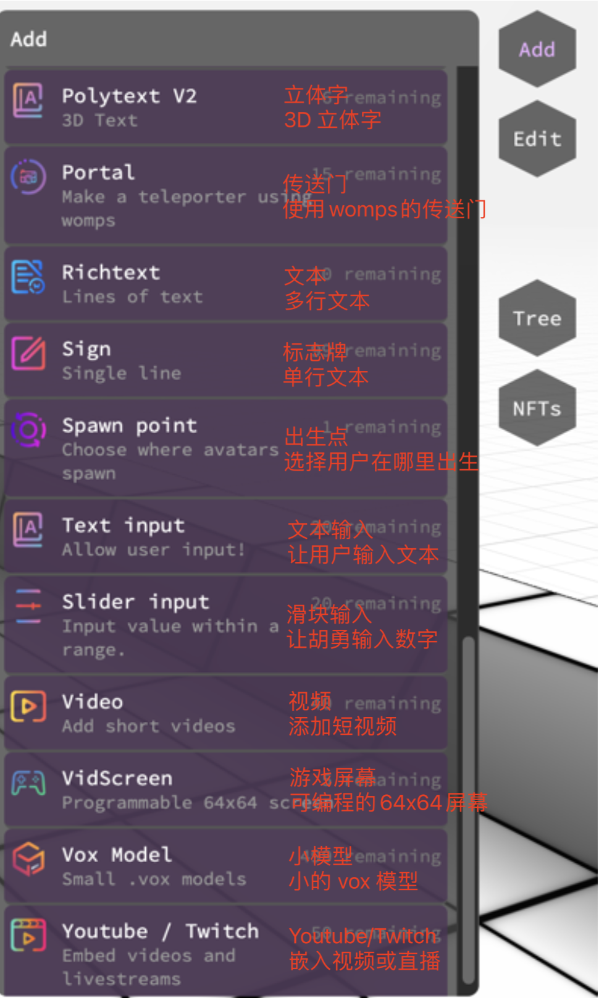

(Features)=
# 功能 Features

要放置功能，您必须位于具有建筑权的地块中，然后按 TAB 键。

<div style="display: flex;">
    
    <div style="width: 10%;" > 
    </div>
    
</div>

功能列表

| Feature | Description | Feature | Description |
| ------ | ------ | ------ | ------ |
|   [音频Audio](#audio) | 播放 mp3 |  [扬声器Boombox](#boombox) | 让用户直播音频 |
| [按钮Button](#button) | 脚本使用 |  [立方体Cube](#cube) | 材质立方体 |
|  [访客留言本Guest Book](#image) |访客可以签字的留言本 |  [POAP Dispenser](#POAP-Dispenser) |向参加活动访客提供 POAP token |
|  [图片Image](#image) | 来自 URL 的图片 |   [灯笼Lantern](#lantern) | RGB灯源 |
| [大模型Megavox](#megavox) | 大的 `.vox` 模型 |  [NFT 图片Image](#nft-image) | 你拥有的 NFTs |
| [NFT 模型Model](#nft-model) | 你的 3d Voxels NFTs | [拟烟粒子Particles](#particles) | 添加拟烟粒子 |
| [立体字Polytext V2](#polytext) | 3D 文本 |  [传送门Portal](#portal) |使用 womps 的传送门 |
| [文本Richtext](#richtext) | 多行文本 |  [标志牌Sign](#sign) |单行文本 |
| [出生点Spawn-point](#spawn-point) | 选择用户在哪里出生 |   [文本输入Text Input](#text-input) |让用户输入文本|
| [滑块输入Slider input](#slider-input) | 让用户输入数字 | [视频Video](#video) |添加短视频|
| [游戏屏幕VidScreen](#vid-screen) |可编程的 64x64 屏幕| [小模型VOX](#vox-model) |小 .vox 模型|
| [Youtube/Twitch](#youtube) |嵌入视频和直播|

## 功能目录

```{toctree}
:maxdepth: 1

Audio feature 音频功能.md
Boombox 扬声器.md
Button 按钮.md
Call Bell 呼叫铃.md
Collectible Model 收藏模型.md
Cube 立方体.md
Group 组.md
Image 图像.md
Lantern 灯笼.md
Megavox 巨型Vox.md
NFT Image ｜ NFT 图像.md
NFT-model ｜ NFT-模型.md
Particles 粒子.md
Platform 平台.md
POAP Dispenser ｜ POAP 分配器.md
Polytext.md
Portal 传送门.md
Richtext 富文本.md
Screen 屏幕.md
Sign 标志.md
Slider input 滑动输入.md
Spawn-point 出生点.md
Submit to Asset library 提交到资产库.md
Text Input 文本输入.md
Video 视频.md
VidScreen 显示屏.md
Vox model ｜ Vox 模型.md
YouTube & Twitch 油管&Twitch直播.md
```