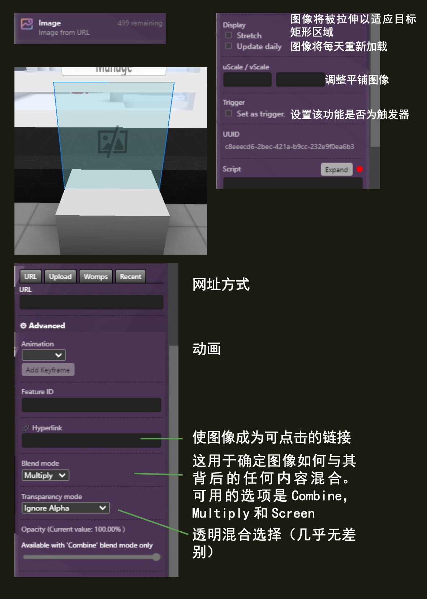

(image)=
# 图像 Image

来自 URL 的二维图像。


## Editor 编辑器




### URL

图像的URL，URL 必须是以 `https://...` 开头。

```{note}
示例链接
https://www.voxels.com/images/newlogo.png
```

### Hyperlink 超链接

`(可选)`; 让图像成为可点击的链接。

### Blend mode 混合模式

这用于确定图像如何与其后面的内容混合。可用选项有 `Combine 组合` 、`Multiply 乘法` 和 `Screen 屏幕` 。

### Keep transparency 保持透明

如果勾选，图像中的任何透明度都将转换为黑色。

### Stretch 拉伸

如果勾选，图像将被拉伸以适合目标矩形区域，而不是被裁剪。

### Update daily 每日更新

如果勾选了，图片将每天重新加载。这很有用，例如，如果您有一个轮播广告，在那里图片会更改。

### uScale/vScale

帮助您正确平铺图像

### Trigger 触发器

设置该功能是否为触发器。

## 脚本属性

::::{tab-set}
:::{tab-item} url
`String`; Links must be `https://` and must finish with an extension such as `.jpg/.gif/.png`.

**get()**

```js
feature.get('url')
// returns: "https://..."
```

**set()**

```js
feature.set({'url':"https://www.myurl.com/file.png"})
```

**default**

`""`
:::

:::{tab-item} link
`String`; Links must be `https://`.

**get()**

```js
feature.get('link')
// returns: "https://..."
```

**set()**

```js
feature.set({'link':"https://www.myurl.com/"})
```

**default**

`""`
:::


:::{tab-item} blendMode
`String`

**get()**

```js
feature.get('blendMode')
// returns: 'Combine'
```

**set()**

```js
feature.set({'blendMode': 'Combine'})
```

**default**

`"Multiply"`
:::

:::{tab-item} updateDaily
`Boolean.`

**get()**

```js
feature.get('updateDaily')
// returns: false
```

**set()**

```js
feature.set({'updateDaily': true})
```

**default**

`false`

:::{tab-item} transparent
`Boolean.`

**get()**

```js
feature.get('transparent')
// returns: false
```

**set()**

```js
feature.set({'transparent': true})
```

**default**

`false`
:::

:::{tab-item} stretched
`Boolean.`

**get()**

```js
feature.get('stretched')
// returns: false
```

**set()**

```js
feature.set({'stretched': true})
```

**default**

`false`
:::


:::{tab-item} uScale
`Integer`

**get()**

```js
feature.get('uScale')
// returns: 1
```

**set()**

```js
feature.set({'uScale': 1})
```

**default**

`1`
:::

:::{tab-item} vScale
`Integer`

**get()**

```js
feature.get('vScale')
// returns: 1
```

**set()**

```js
feature.set({'vScale': 1})
```

**default**

`1`
:::

:::{tab-item} type
`String`;

**get()**

```js
feature.get('type')
/* or */
feature.type

// returns: 'image'
```
:::
::::

