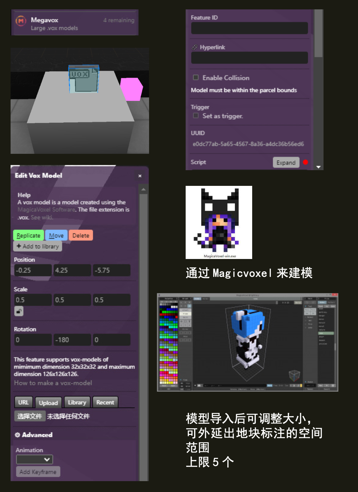

(megavox)=
# 大模型 Megavox

Megavoxes是一个大小为126x126x126 `.vox` 模型，目前每个地块Parcel限制为5个。


## Editor 编辑器




### URL

`.vox` 文件的 URL。

```{note}
链接示例
`https://raw.githubusercontent.com/leicheng42/Voxels-Wiki/main/docs/static/img/magevoxels_monu1.vox`
```

### Hyperlink 超链接

`（可选）`；使 megavox 成为可点击的链接。

```{note}
链接示例：（链接到Voxels说明文档）
`https://voxels-wiki.readthedocs.io/`
```

## 脚本属性

::::{tab-set}
:::{tab-item} url
`String`; Links must be `https://` and must finish with a vox extension `.vox`
Has to link to a 126x126x126 vox model.

**get()**

```js
feature.get('url')
// returns: "https://..."
```

**set()**

```js
feature.set({'url':"https://www.myurl.com/file.vox"})
```

**default**

`""`
:::

:::{tab-item} link
`String`; Links must be `https://`.

**get()**

```js
feature.get('link')
// returns: "https://..."
```

**set()**

```js
feature.set({'link':"https://www.myurl.com/"})
```

**default**

`""`
:::

:::{tab-item} collidable
`Boolean`

**get()**

```js
feature.get('collidable')
// returns: false
```

**set()**

```js
feature.set({'collidable': true})
```

**default**

`false`
:::

:::{tab-item} type
`String`;

**get()**

```js
feature.get('type')
/* or */
feature.type

// returns: 'megavox'
```
:::
::::