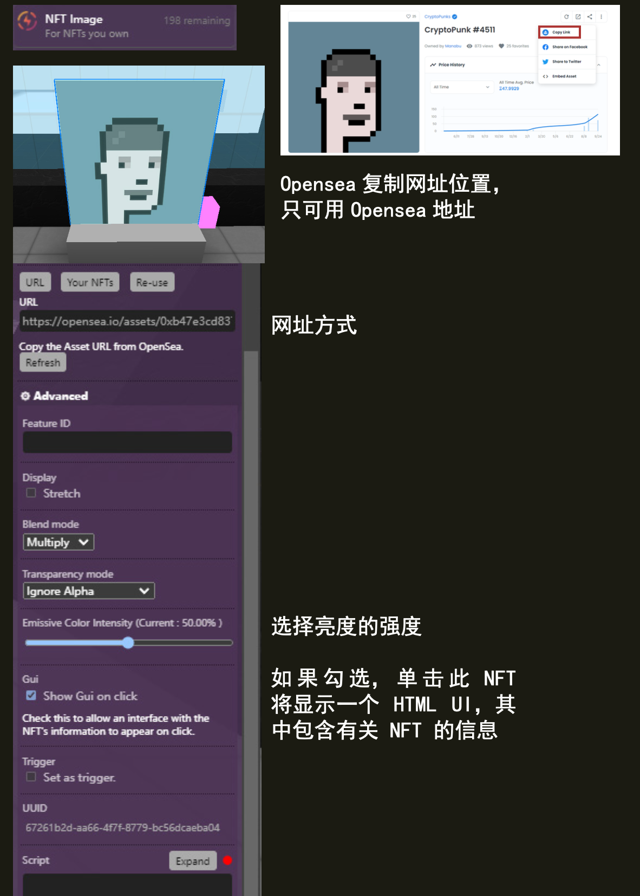

(nft-image)=
# NFT 图像 NFT Image 

展示您所拥有的NFT图像。


## Editor 编辑器



### Opensea Asset URL ｜ Opensea 资产 URL

```{note}
示例链接，可以在 https://opensea.io/ 创建自己的NFTs
https://opensea.io/assets/ethereum/0x495f947276749ce646f68ac8c248420045cb7b5e/112862529825773578657241264150888633317941584966682201326871688929680778330122/
```

复制 OpenSea 中的资产 URL。

### stretch 拉伸

拉伸图像以适应比例。

### Blend Mode 混合模式

这用于确定图像如何与其后面的内容混合。可用选项有 `Combine 组合` 、`Multiply 乘法` 和 `Screen 屏幕` 。

### Transparency mode 透明度模式

选择如何处理alpha值。（忽略或不忽略）

### Emissive Color intensity 发射颜色强度

选择亮度的强度。

### Gui

如果勾选，点击此 NFT 将显示一个 HTML UI，其中包含有关 NFT 的信息

## 脚本属性

::::{tab-set}
:::{tab-item} url
`String`; Links must be `https://`.

**get()**

```js
feature.get('url')
// returns: "https://..."
```

**set()**

```js
feature.set({'url':"https://www.opensea.io/"})
```

**default**

`""`
:::

:::{tab-item} stretch
`Boolean`; 

**get()**

```js
feature.get('stretch')
// returns: "https://..."
```

**set()**

```js
feature.set({'stretch':true})
```

**default**

`false`
:::

:::{tab-item} blendMode
`ImageMode`; An enum :
- 'Multiply'
- 'Screen'
- 'Combine'

**get()**

```js
feature.get('blendMode')
// returns: "Multiply"
```

**set()**

```js
feature.set({'blendMode':"Combine"})
```

**default**

`Combine`
:::

:::{tab-item} emissiveColorIntensity
`number`; 

**get()**

```js
feature.get('emissiveColorIntensity')
// returns: "0.5"
```

**set()**

```js
feature.set({'emissiveColorIntensity':0.5})
```

**default**

`0.5`
:::

:::{tab-item} type
`String`;

**get()**

```js
feature.get('type')
/* or */
feature.type

// returns: 'nft-image'
```
:::
::::

## 脚本方法

::::{tab-set}
:::{tab-item} getNftData
A function that returns the opensea nftData of the specified feature.

- Arguments: callback (optional); a callback function to handle the nft's data.

**example**

```js
feature.getNftData(console.log)
/* returns: 
{
animation_original_url: "https://ipfsga..."
animation_url: "https://stora..."
asset_contract: {...}
...
}
*/
```

**example 2**

```js

function showContractAddress(data){
 console.log(data.asset_contract.address) 
}

feature.getNftData(showContractAddress)
/* returns: 0x1das1rs6dfv...  */

```
:::
::::

