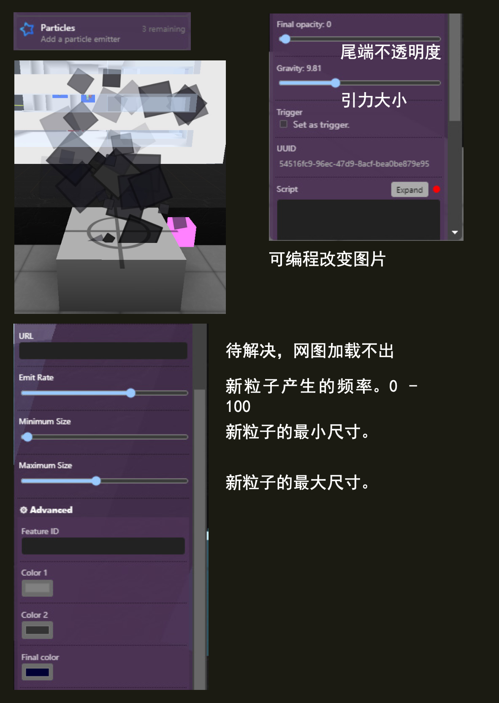

(particles)=
# 拟烟粒子 Particles


## Editor 编辑器



### Emit rate 发射率

新粒子产生的频率。 0 - 100

### Minimum size 最小尺寸

新粒子的最小尺寸。

### Maximum size 最大尺寸

新粒子的最大尺寸。

### URL

自定义粒子图像的URL；如果未提供，则将使用默认粒子图像（灰色方块）。

```{note}
示例链接
https://www.voxels.com/images/newlogo.png
```

### Color 1 and Color 2 颜色1和颜色2

新粒子的初始颜色取决于这些参数的值 - 颜色将位于两个给定颜色之间的范围内。

## 脚本属性

::::{tab-set}
:::{tab-item} url
`String`; Links must be `https://` and must finish with an extension such as `.jpg/.gif/.png`.
> If you set an URL, the custom colors color1 and color2 will be ignored.
{.is-info}

**get()**

```js
feature.get('url')
// returns: "https://..."
```

**set()**

```js
feature.set({'url':"https://www.myurl.com/file.png"})
```

**default**

`""`
:::

:::{tab-item} emitRate
`Double`; Must be a number between 0 and 100.

**get()**

```js
feature.get('emitRate')
// returns: 50.0
```

**set()**

```js
feature.set({'emitRate':52})
```

**default**

`50`
:::


:::{tab-item} minSize
`Double`; Must be a number between 0 and 1.

**get()**

```js
feature.get('minSize')
// returns: 0.5
```

**set()**

```js
feature.set({'minSize':0.5})
```

**default**

`0.5`
:::


:::{tab-item} maxSize
`Double`; Must be a number between 0 and 1.

**get()**

```js
feature.get('maxSize')
// returns: 0.5
```

**set()**

```js
feature.set({'maxSize':0.5})
```

**default**

`0.5`
:::

:::{tab-item} color1
`String` - hexadecimal; 

**get()**

```js
feature.get('color1')
// returns: "#4cb844"
```

**set()**

```js
feature.set({'color1':"#4cb844"})
```

**default**

`#000000`
:::

:::{tab-item} color2
`String` - hexadecimal; 

**get()**

```js
feature.get('color2')
// returns: "#4cb888"
```

**set()**

```js
feature.set({'color2':"#4cb844"})
```

**default**

`"#000000"`
:::


:::{tab-item} type
`String`;

**get()**

```js
feature.get('type')
/* or */
feature.type

// returns: 'particles'
```
:::
::::

## Deprecations
for information on versioning [click here](https://wiki.cryptovoxels.com/en/versioning-and-deprecations)

### 5.7.0

The particle feature can now be rotated in the X-axis instead of being hard-coded to 90 deegres. This means that the next time a particle system is edited, it will use the X-axis rotation set by the owner which most likey look weird, but can be easily corrected at that time.
