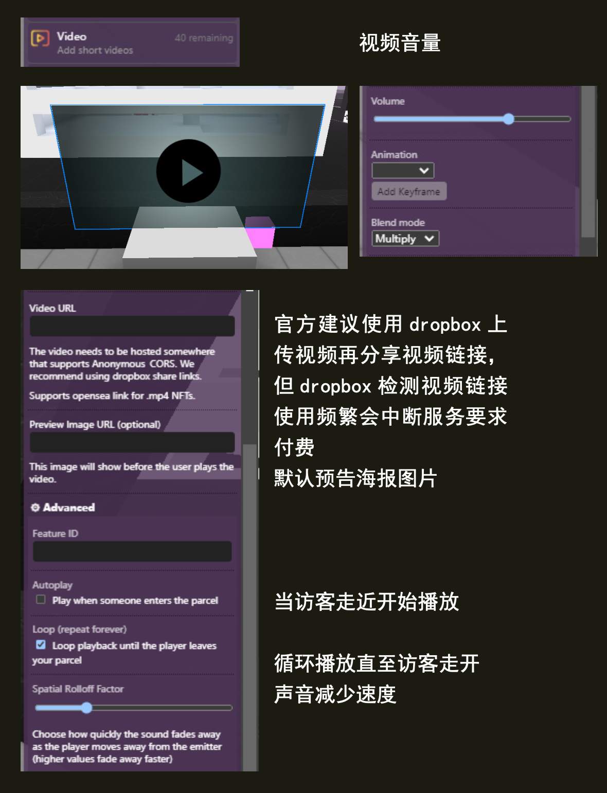

(video)=
# 视频 Video

添加可点击播放的短视频。


## Editor 编辑器



### URL

要播放的视频的 URL。必须以“https://”开头，并以视频扩展名结尾，例如“.mp4”。

示例url  `https://raw.githubusercontent.com/leicheng42/Voxels-Wiki/main/docs/static/img/%E5%91%A8%E6%9D%B0%E4%BC%A6MTV_%E9%9D%92%E8%8A%B1%E7%93%B7.mp4`

### Image preview 图片预览

`（可选）` 让用户为视频设置自定义缩略图。

### Blend mode 混合模式

这用于确定图像如何与其后面的内容混合。可用选项有 `Combine 组合` 、`Multiply 乘法` 和 `Screen 屏幕` 。


## 脚本属性

::::{tab-set}
:::{tab-item} url
`String`; Has to start with `https://` and has to end with a video extension such as `.mp4`.

**get()**

```js
feature.get('url')
// returns: "https://..."
```

**set()**

```js
feature.set({'url':"https://..."})
```

**default**

`""`
:::

:::{tab-item} previewUrl
`String`; Links must be `https://` and must either be a `.png,.gif,.jpg`.

**get()**

```js
feature.get('previewUrl')
// returns: "https://..."
```

**set()**

```js
feature.set({'previewUrl':"https://..."})
```

**default**

`""`
:::

:::{tab-item} type
`String`;

**get()**

```js
feature.get('type')
/* or */
feature.type

// returns: 'video'
```
:::
::::


## 脚本方法

::::{tab-set}
:::{tab-item} play()

```js
feature.play()
```
plays the video
:::

:::{tab-item} pause()
```js
feature.pause()
```
pauses the video
:::

:::{tab-item} stop()
```js
feature.stop()
```
stops the video
:::