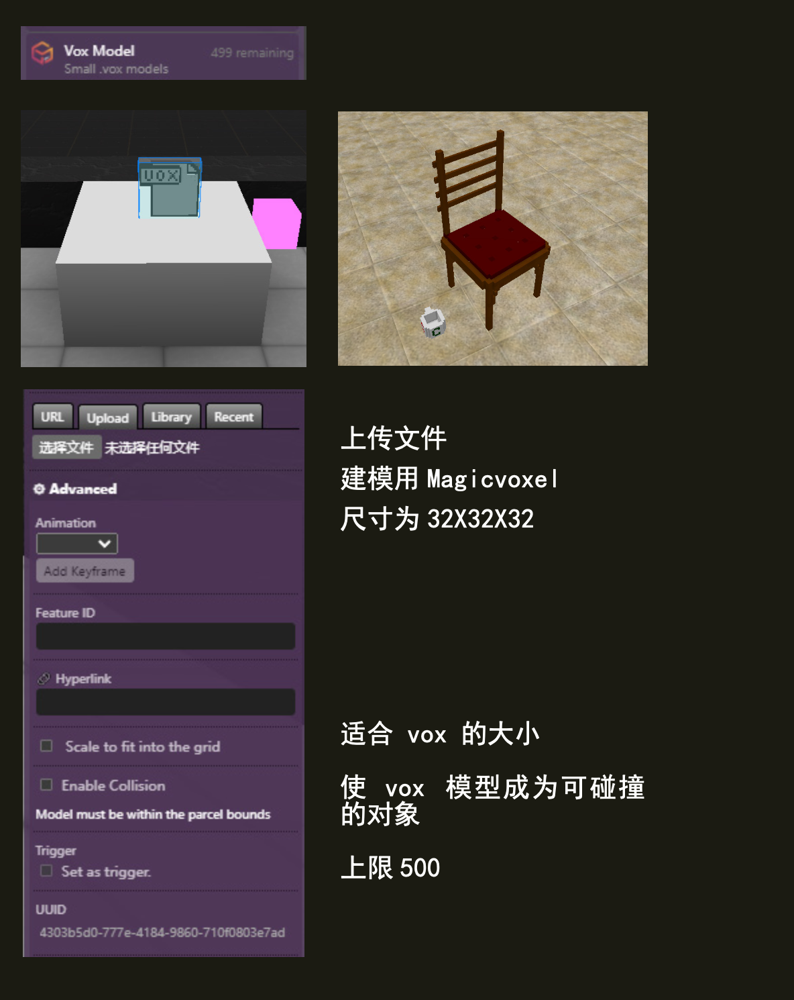

(vox-model)=
# 小模型 Vox

Vox 是小型 (32x32x32) .vox 型号，目前每个地块仅限 200 个。这些通常是使用 [Magicavoxel](https://ephtracy.github.io/) 制作的。


## Editor 编辑器



### URL

`.vox` 文件的 URL。

```{note}
模型示例：
`https://cdn.discordapp.com/attachments/573736707984457738/733461614107426836/aliem.vox`
```

### Hyperlink 超链接

`（可选）`；使 megavox 成为可点击的链接。

### Scale to fit 调整缩放

`（可选）`；调整 vox 的大小以适合网格。

### Collidable 可碰撞

`（可选）`；使 vox 模型成为可碰撞对象。

### Colors 颜色

`（可选）`；
允许您更改 vox 模型的颜色。
*如果您的 vox 颜色超过 5 种，则不会出现此选项。*


## 脚本属性

::::{tab-set}
:::{tab-item} url
`String`; Links must be `https://` and must finish with a vox extension `.vox`
Has to link to a 32x32x32 vox model or smaller.

**get()**

```js
feature.get('url')
// returns: "https://..."
```

**set()**

```js
feature.set({'url':"https://www.myurl.com/file.vox"})
```

**default**

`""`
:::

:::{tab-item} link
`String`; Links must be `https://`.

**get()**

```js
feature.get('link')
// returns: "https://..."
```

**set()**

```js
feature.set({'link':"https://www.myurl.com/"})
```

**default**

`""`
:::

:::{tab-item} collidable
`Boolean`

**get()**

```js
feature.get('collidable')
// returns: false
```

**set()**

```js
feature.set({'collidable': true})
```

**default**

`false`
:::

:::{tab-item} type
`String`;

**get()**

```js
feature.get('type')
/* or */
feature.type

// returns: 'vox-model'
```
:::
::::