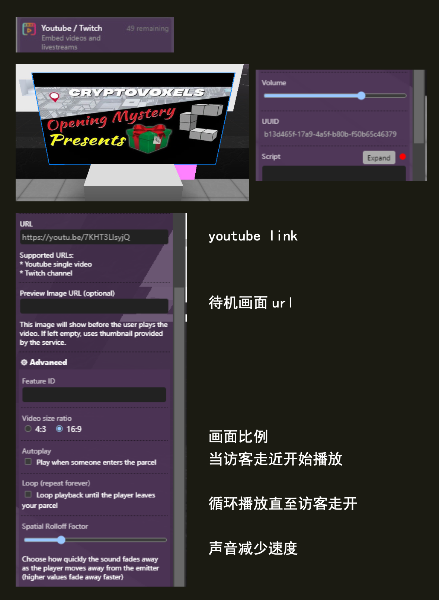

(youtube)=
# YouTube/Twitch 

嵌入 YouTube 视频/直播 或 Twitch 直播。


## Editor 编辑器



### Screen ratio 屏幕比例

视频的屏幕比例：`16:9` 或 `4:3`。

### URL

要播放的视频的 YouTube/Twitch URL。

https://www.youtube.com/watch?v=Q5-0hl_4X_g

https://www.twitch.tv/muse_tw

### Thumbnail url 缩略图URL

`（可选）` 让用户为视频设置自定义缩略图。

## 脚本属性

::::{tab-set}
:::{tab-item} url
`String`; Links must be `https://` and must either be a `youtube, twitch, soundcloud, spotify`.

**get()**

```js
feature.get('url')
// returns: "https://..."
```

**set()**

```js
feature.set({'url':"https://www.youtube.com/?v=..."})
```

**default**

`""`
:::

:::{tab-item} previewUrl
`String`; Links must be `https://` and must either be a `.png,.gif,jpg`.

**get()**

```js
feature.get('previewUrl')
// returns: "https://..."
```

**set()**

```js
feature.set({'previewUrl':"https://..."})
```

**default**

`""`
:::

:::{tab-item} screenRatio
`String`; Links must be `https://` and must either be a `.png,.gif,jpg`.

**get()**

```js
feature.get('screenRatio')
// returns: "43"
```

**set()**

```js
feature.set({'screenRatio':"169"})
```

**default**

`"169"`
:::

:::{tab-item} type
`String`;

**get()**

```js
feature.get('type')
/* or */
feature.type

// returns: 'youtube'
```
:::
::::

## 脚本方法

::::{tab-set}
:::{tab-item} play()
```js
feature.play()
```
plays the video
:::

:::{tab-item} feature.pause()
```js
feature.pause()
```
pauses the video
:::
::::