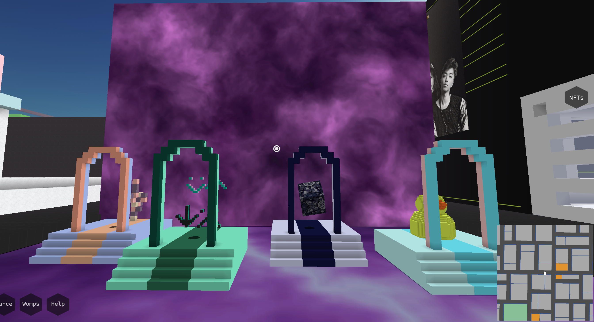
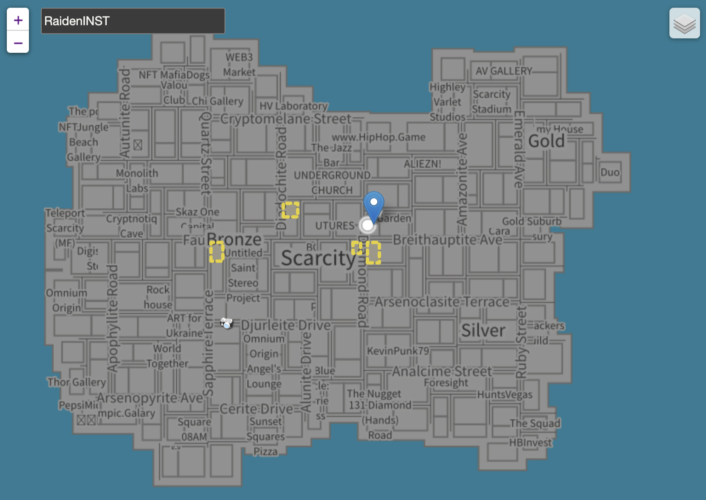

# Voxels 里的雷电所

## [前往雷电所](https://www.voxels.com/play?coords=SW@1369W,1116S)

## 雷电所位置

## 地块信息

|地块信息|内容|
|---|---|
|地址   Address|61 Diamond Road，Scarcity Island Address|
|坐标   Location|1369W，1116S|
|面积   Area|112 m²|
|尺寸   Size|8 X 14 m|
|高度   Height|13 m|
|层高   Build Height|10 m |
|高度区间   Elevation|-3 to 10 m |
|体积   Volume|8960 voxels|
|链接   Link|https://www.voxels.com/play?coords=SW@1369W,1116S |

