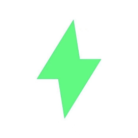

# 雷电所的Voxel文档

雷电所的Voxel文档，在 [官方Wiki](https://wiki.cryptovoxels.com/) 的基础上进行翻译和整理。                                      

:::::{grid} 2

::::{grid-item}
:::{card} 介绍
:link: introduction
:link-type: ref
Voxels 的介绍页。
::::

::::{grid-item}
:::{card} 快速上手
:link: quick_start
:link-type: ref
跟着教程，用最短时间了解 Voxels。
:::
::::
:::::

:::::{grid} 2

::::{grid-item}
:::{card} 雷电所
:link: raiden
:link-type: ref
Voxels 世界中的雷电所。
:::
::::

:::::

##  雷电所RaidenINST


「雷电所」（Raiden INST）成⽴于2020年。取名为“雷电”，是取其物理原理的象征性意义——雷电是云内（艺术界内部）、云与云（跨学科）或云与大地（艺术与大众文化）之间的放电现象，意指了交流、协作与能量的传递。

作为非营利的艺术机构，它通过跨学科的合作，探索艺术、科技、自然的边界，以及技术与⼈类认识和感官的内在联系；同时，致⼒于实践⽩盒⼦之外的展示可能性，以策展⼈、艺术家等身份存在，具有很强的灵活性和合作性。 

「雷电所」寄希望于通过对现实与社会语境的关注，为青年艺术家的实践，提供孵化、展示和传播的平台。所以，其联合各方资源，筹备了“青年科技艺术扶持计划”，并策划了科技艺术展“不准停电”。根植于当代艺术生态的变化，它将持续优化自身机制，联动国内外机构，以推出新的项目与展览。


##  体素Voxels

Voxels 前身是Cryptovoxels， 是元宇宙的主流应用Cryptovoxels、Decentraland、The Sandbox之一。

Cryptovoxels的英文直译就是加密体素，也就是字面意思，Voxels-体素就是像素的3D版本，是构成其世界的最小单元。国内常简称其为CV，如其名称，CV世界的外观是像素风格的，有点类似游戏《我的世界》，但画质更加精细，且创作维度更加广阔。

CV是一个真正属于用户的真实平行世界，它致力于利用个人和社群的创造力来打造美术馆，商店等艺术性社交的场地，承载了人类关于数字平行宇宙的瑰丽幻想。目前已有多个艺术家、机构、项目方在CV的世界开设了自己的展馆，偶尔还会在CV内举办艺术展、访谈等活动。 [参考链接](https://www.yuanyuzhouneican.com/article-473842.html)

## 文档目录

```{toctree}
:maxdepth: 1

wiki_zh/introduction
wiki_zh/quick_start
wiki_zh/RaidenINST
wiki_zh/Voxels_library.md
wiki_zh/add_to_library.md
wiki_zh/virtual_reality.md
wiki_zh/the_world.md
```


```{toctree}
:maxdepth: 1

wiki_zh/Parcels/Parcels
```


```{toctree}
:maxdepth: 1

wiki_zh/Players/Players
```


```{toctree}
:maxdepth: 1

wiki_zh/-Features/Features

```


```{toctree}
:maxdepth: 1

wiki_zh/Scripting/Scripting
```

